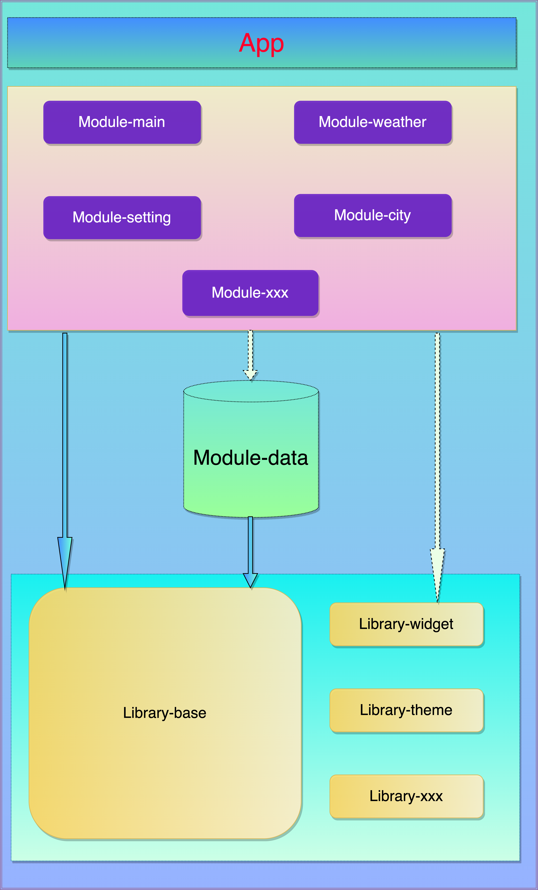
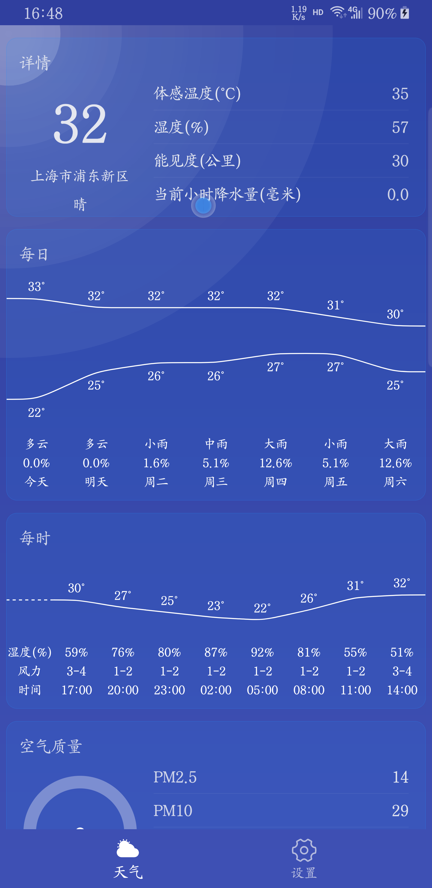
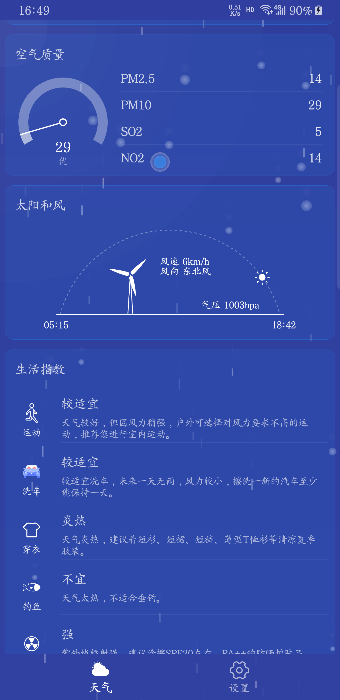
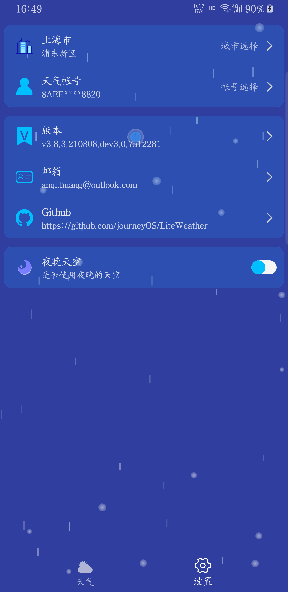
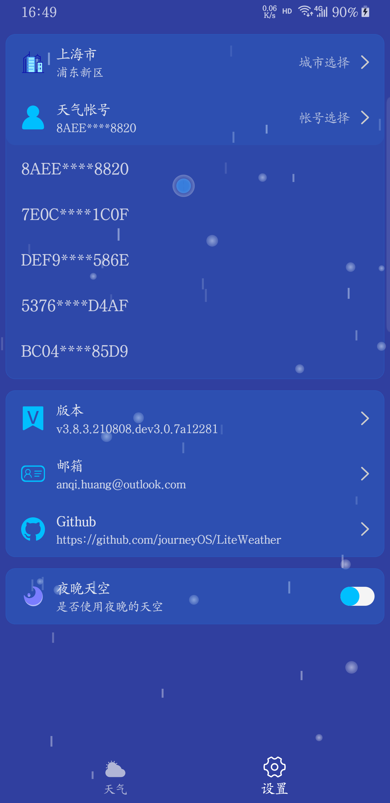
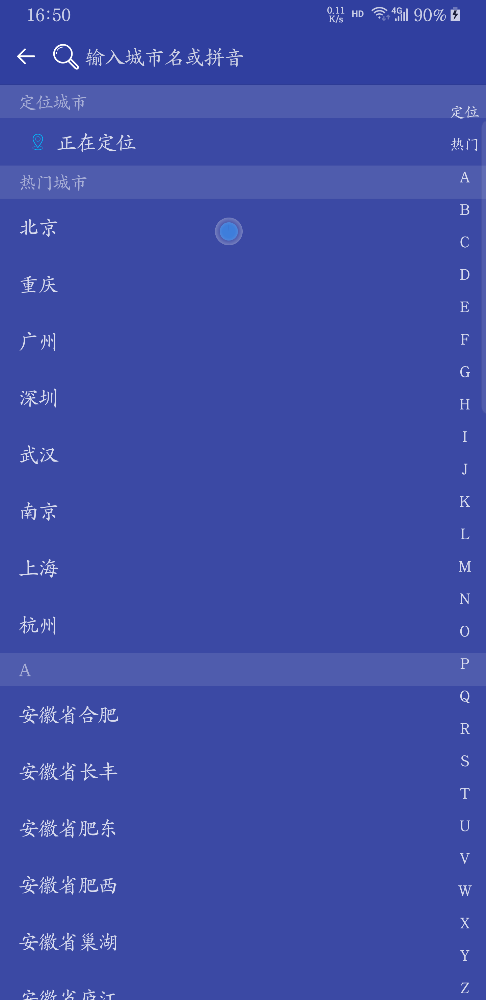

# LiteWeather
[TOC]

# 前言
2018为了练习使用LiveData、ViewModel等开发了此工程，后续因为工作繁忙以及自身懒惰就没继续更新该工程。这段时间回过头来看以前的代码，不能说是一坨shi吧，它就是一坨shi。所以萌生了使用**DataBinding + LiveData + ViewModel**框架为基础，并整合**Okhttp + RxJava + Retrofit + Glide**等流行模块，让事件与数据源完美绑定，不再使用butterknife或者findViewById的形式。

# 框架


## 宿主
如上述框架图中的App就叫做宿主。它没有**activity、layout**，它的职责是将分工开发的组件合而为一，打包成一个可用的Apk。

在宿主工程中，主要包含两个东西：
- **AndroidManifest.xml**：配置application、启动页面等
- **build.gradle**：负责配置构建编译/打包参数，依赖子模块。

## 组件
组件其实也就是一个Module，在合并打包的时候它是一个library，在独立编译运行的时候，它是一个application。
具体可参考module.gradle。
如上述框架图中的module-main、module-weather、module-setting、module-city都是组件。
从名字也看出module-main就是主要入口的模块，module-weather就是跟天气相关的模块，module-setting就是跟设置相关的模块，module-city当然也就是跟城市相关的模块。

> module-core-data其实也算组件也算Library，这个有点特殊，下文再聊。

## Library
Library其实就是存放一些公共方法、公共常量等。
如上述框架图中的：
- **library-base**:
	- 流行框架**Okhttp + RxJava + Retrofit + Glide**
	- 数据绑定**DataBinding**
	- MVVM开发模式**Model层负责将请求的数据交给ViewModel；ViewModel层负责将请求到的数据做业务逻辑处理，最后交给View层去展示**
	- 基类封装**BaseActivity、BaseFragment、BaseViewModel**，在View层中不再需要定义ViewDataBinding和ViewModel，直接在BaseActivity、BaseFragment上限定泛型即可使用
	- 全局事件回调**RxBus、Messenger**两种回调方式

- **library-widget**
	- sky天空控件
	- weather控件
	- setting控件

- **library-theme**:主题相关，但不要存放一个跟主题无关的图片等资源。比如svg_city只是module-city才用到，最好不要把module-city独立的资源放到别的地方，这样做的好处是后续万一某个工程需要module-city，直接把module-city拷贝过去即可。

## Repository
本工程里Repository是module-core-data组件。本来的设计思路是module-xxx被APP依赖，而module-xxx之间又不能互相依赖，但是在开发过程中可能几个module都需要数据，如果每个module都自己管理repository显然不太可能。最开始的是把repository放在**library-base**中的，后来觉得repository显然定义为module更合适。但这样定义又违背了**module-xxx之间又不能互相依赖**，显然我很爱自己给自己打脸，又或者我自己太纠结了，直接定义成library-data就好了。反正现在写到这段话的时候我已经有把module-core-data改成library-data的想法了。。。


## 组件间通信
组件间是完全无耦合的存在，但是在实际开发中肯定会存在业务交叉的情况，在本工程中提供了两种方案：
### ARouter
[ARouter](https://github.com/alibaba/ARouter)拥有强大的路由机制。ARouter在library-base中依赖，所有组件又依赖于library-base，所以它可以看作为组件间通信的桥梁。
比如，在组件A中跳转到组件B页面：
```java
ARouter.getInstance()
    .build(router_url)
    .withString(key, value)
    .navigation();
```
在组件B页面中接收传过来的参数：
```java
@Route(path = router_url)
public class BActivity extends BaseActivity{
	@Autowired(name = key)
	String value;
}
```

### RxBus
在组件A中注册接收：
 private Disposable mSubscription;

```java
/**
 * 订阅天空变化
 */
public void subscribeSky() {
    mSubscription = RxBus.getDefault().toObservable(SkyType.class)
            .observeOn(AndroidSchedulers.mainThread()) //回调到主线程更新UI
            .subscribe(new Consumer<SkyType>() {
                @Override
                public void accept(final SkyType skyType) throws Exception {
                    initSky(skyType);
                }
            });
    //将订阅者加入管理站
    RxSubscriptions.add(mSubscription);
}

/**
 * 取消订阅，防止内存泄漏
 */
public void unsubscribe() {
    RxSubscriptions.remove(mSubscription);
}
```

组件B传数据给组件A：
```java
RxBus.getDefault().post(skyType);
```

# App效果







# 使用

- 在根目录的build.gradle中加入
```gradle
allprojects {
    repositories {
		...
        maven { url 'https://jitpack.io' }
    }
}
```

- 在主项目app的build.gradle中依赖
```gradle
dependencies {
    ...
    implementation 'com.github.journeyOS:LiteFramework:2.3.0'
}
```

- 具体用法可以把LiteWeather工程下载查看详情，基本上LiteWeather业务也不多，算是一个demo了。